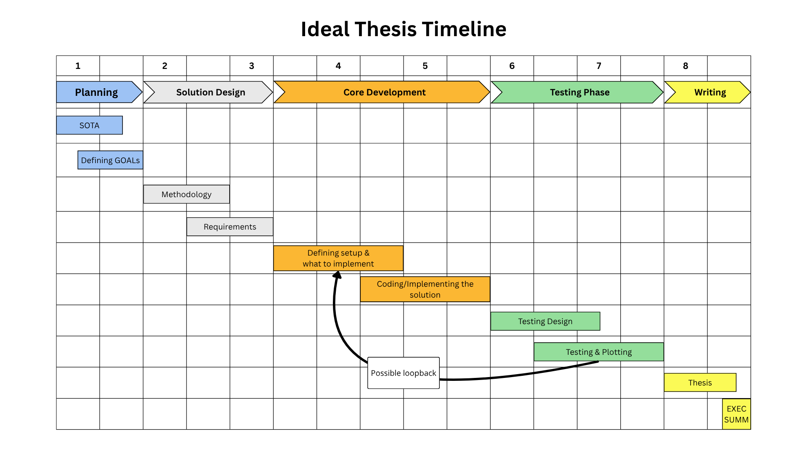

# How we work

Tipically, we follow the timeline reported in the figure below. The ideal thesis timeline has a duration of 8 months in which there are 5 phases:

- Planning: here you have to read our previous works and update your knowledge looking for similar research works in the State of The Art (SOTA). Then, together we define the objectives of your thesis (i.e. what it is the desired outcome).
- Solution Design: now you have to find out a methodology to achieve what we have agreed on, defining a technology to use and its boundaries to face.
- Core Development: sooner or later you will have to implement what was previously designed through the definition of a setup and what to be implemented.
- Testing Phase: after having coded it, you are required to test it...appropriately...if something does not work, here it will come out with the consequence of going through a loopback, restarting from the beginning of the core development. Of course, it will not add a delay of 3 months for completing your thesis. Since you have already been through it before, the delay will result in a short-time one.
- Writing: it's the right time to start to write your thesis! You have to collect everything you have done so far and reorganize it to explain what we have achieved together.

Naturally, you will not be left on your own during all the research. We will be there to help you in every phase of the thesis and, technically speaking, the secondary aspects of the thesis (e.g. technology, methodology, ...) have almost all been decided, so that you can tackle the main topic as effectively as possible.

If it is so, what is the final goal of a thesis?
The real goal is to make you learn how to organize yourself during the entire working period, how to face the issues that will be raised up, how to conduct a reseach, and how to draw up a document to mark the completion of a project.

This is very important for you even if you do not want to pursuit for an academia/research career since the life cycle of an industrial project is very similar to the one you will encounter whilst writing your dissertation.
Therefore, your dissertation marks both the conclusion of your course of study and a formative stage in your professional life.

TAKE IT SERIOUSLY!

