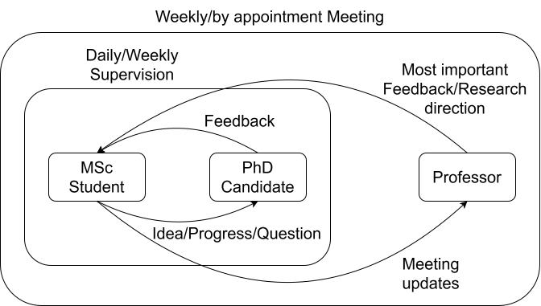
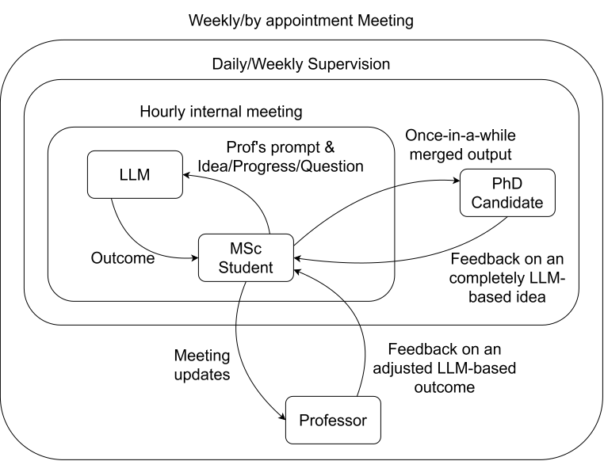

# Supervision loop

## Intended feedback loop

This should be the intended feedback loop to make some weekly progress during your thesis.

## Unintended feedback loop

With the advent of AI and LLM models, there is now the possibility to integrate them into our research process. It is not my intention to check periodically how often you are using an LLM and how. Anyway, I would like to suggest you to avoid completely the behaviour described in this figure.

You should not try to replicate this since we can (or, at least, should be able to) understand if your thesis is developed by you or by the lastest flagship LLM model...
